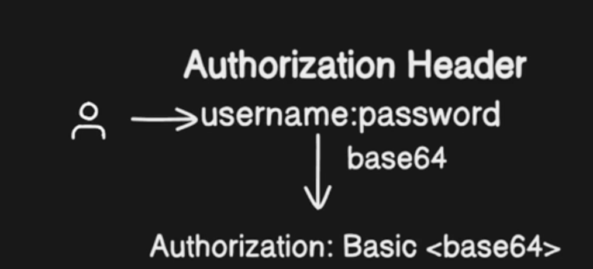
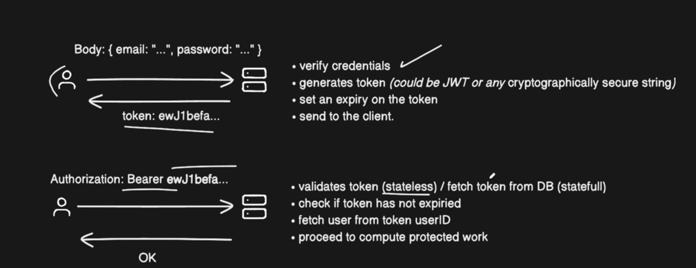
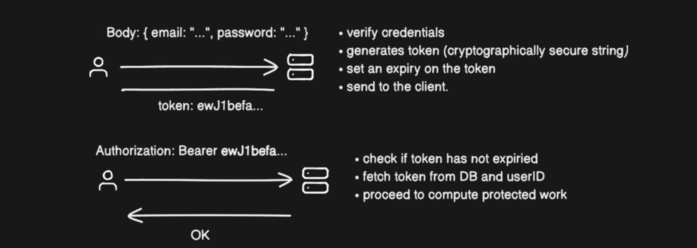

# Types of most used Authentication

There are 3 types
- Basic authentication
- Stateless authentication
- Stateful authentication

## 1. Basic Authentication

- User makes every request with `username & password` to get the response back.
- The requests will have `Authorization: Basic <base64>` as a header. The password is encoded in `<base64>`.

#### Usage & Pros:
- Usefull for simple apps with very few users
- Mainly used for private tooling like `Feature flag UI`, `metrics portal` etc.

#### Cons:
- Doesn't scale well
- Constantly needs to check password on every request

## 2. Stateless Authentication with token

- **Step 1:** Body: `{ email: "...", password: "..." }`
    - Verify credentials
    - Generate token (could be JWT or any cryptographically secure string)
    - Set an expiry on the token
    - Send to the client

- **Step 2:** `Authorization: Bearer ewJ1befa...`
    - Validates token (stateless) / fetch token from DB (stateful)
    - Check if token has not expired
    - Fetch user from token's userId
    - Proceed to complete the protected task.

#### Usage & Pros:
- Secales very well, no need to mantain state.
- No need to hash and compare passwords on every request.
- JWT: Supports claims (Good for system to system communication)
- Ability to have presistance auth from small to big periods of time without credentials re-validation.

#### Cons:
- We need to manage the tokens (storing, validating, caching, in-validating, etc)
- Tokens become stale (outdated, expired, or invalid due to inactivity)
- Can't revoke once they are issued. (Blocklist can be used to restrict access this this case)
- JWT common attacks.

#### Notes:
1. Don't store than you need in tokens, `No permissions`, `no roles` - nothing that can become stale.

## 3. Stateful Authentication

- **Step 1:** Body: `{ email: "...", password: "..." }`
    - Verify credentials
    - Generate token (cryptographically secure string, recommended NOT to use JWT, because that will defeat the purpose of stateful)
    - Set an expiry to the token.
    - Send to client and store in the db.

- **Step 2:** `Authorization: Bearer ewJ1befa...`
    - Check if token is not expired.
    - Fetch token and userID from DB.
    - Proceed to complete the protected task.

#### Usage & Pros:
- API maintains control over the token.

#### Cons:
- We need to make atleast 1 database lookup for the token.

